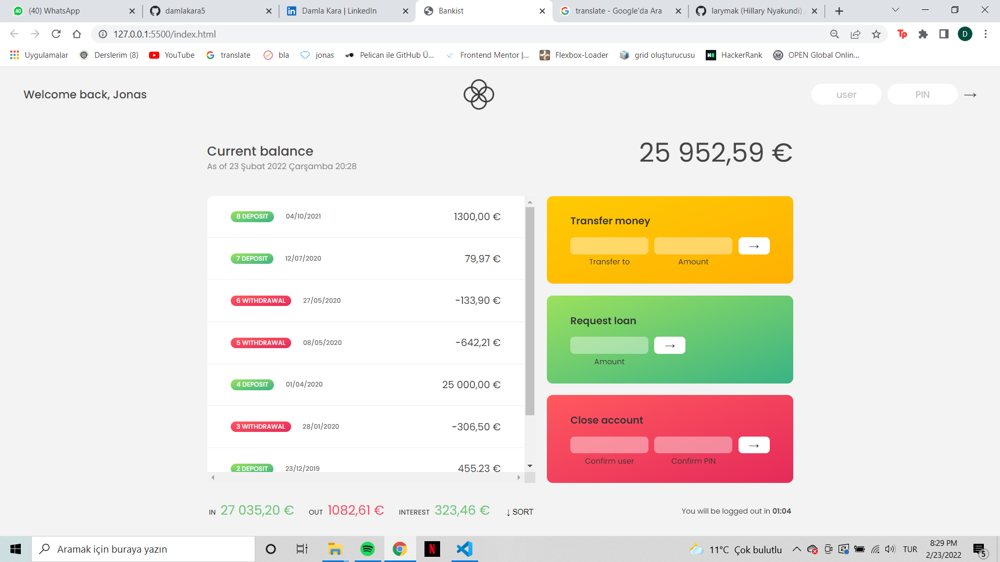

# Bankist Account

This is a bankist account project where users can do a lot of things made with JavaScript.

## Table of contents

- [About](#about)
  - [Screenshot](#screenshot)
  - [Built with](#built-with)
- [Author](#author)

### About

Users should be able to:

- View the optimal layout depending on their device's screen size
- Login they bank account with their username and pin (U can use js and 1111)
- See current balance, movements, balance date, summary of the movements etcetera
- Transfer money by entering the username of the person to be sent and the amount of money to be sent
- Request loan by entering amount
- Close account by confirm username and pin
- Sort the movements In ascending or descending order by the sort button
- The timer logs out the user.

\*\*If you want you can check the flowchart.

### Screenshot

### Built with

- Semantic HTML5 markup
- CSS custom properties
- Flexbox
- CSS Grid
- JavaScript

## Author

- Website - [Damla Kara](https://www.linkedin.com/in/damla-kara-348081232/)
